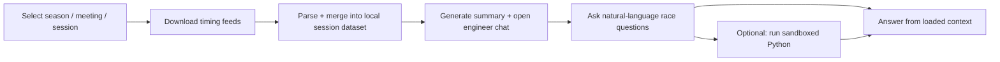

# f1aire

Terminal-first Formula 1 race engineering with real session data.

`f1aire` downloads official F1 live timing streams for a session, builds a structured local view of the race, and gives you an AI engineer to interrogate that data in plain language. You can also run sandboxed Python (Pyodide) for custom analysis.

This project is built to be easy to read, easy to trust, and easy to contribute to.

## Start In 30 Seconds

```bash
npx -y f1aire@latest
```

Requirements:

- Node `>= 24.13.0`
- OpenAI API key (`OPENAI_API_KEY`) or in-app key entry

## At A Glance

| Topic | Summary |
|---|---|
| Interface | Interactive terminal UI (Ink) |
| Data source | Official F1 live timing feeds |
| Core value | Ask race-engineering questions against real loaded session data |
| AI | OpenAI model-backed engineer chat with session context |
| Advanced analysis | Sandboxed Python via Pyodide |
| Quality bar | Type safety, tests, linting, predictable scripts |

## Why It Is Useful

- It answers race questions against actual loaded timing data, not generic summaries.
- It keeps a fast terminal workflow: select session, download, ask.
- It supports both quick Q&A and deeper custom computation.
- It stays transparent: local data files, explicit commands, testable modules.

## How It Works



## What The App Does

1. Lets you pick a season, Grand Prix, and session in the TUI.
2. Downloads and merges live timing feeds from `livetiming.formula1.com`.
3. Opens an engineer chat seeded with session context and summary.
4. Uses the loaded dataset to answer tactical race questions.
5. Optionally runs sandboxed Python against the same context.

Example prompts:

- `Compare Norris vs Verstappen on clean laps 10-25.`
- `What was the undercut window vs car #1 with a 20.5s pit loss?`
- `As of lap 35, who is gaining the most per lap?`

## Configuration

```bash
export OPENAI_API_KEY=...
# Optional, defaults to gpt-5.2-codex
export OPENAI_API_MODEL=...
```

You can set the key in two ways:

- Environment variable (`OPENAI_API_KEY`)
- In-app settings (`s` on picker screens) or prompt during flow

## Keyboard Controls

- Global: Enter select, `b`/Backspace/Esc back, `q` quit
- Chat: Enter send, PgUp/PgDn scroll, Esc back, Ctrl+C quit

## Development

Setup:

```bash
mise install
npm install
```

Run locally:

```bash
mise run dev
# or
npm run dev
```

Build:

```bash
npm run build
```

Quality checks:

```bash
npm run typecheck
npm run lint
npm test
```

Optional networked e2e test (OpenAI API, billed usage):

```bash
npm run test:e2e
```

Project map:

- `src/core`: timing feeds, parsing/merge, data model, summaries
- `src/agent`: engineer session, model wiring, Pyodide tool bridge
- `src/tui`: terminal screens and UI components

## Data Storage

Session artifacts are stored outside the repo in the per-user app data directory (`f1aire/data`).

- macOS/Linux: `$XDG_DATA_HOME/f1aire/data` or `~/.local/share/f1aire/data`
- Windows: `%LOCALAPPDATA%\f1aire\data`, then `%APPDATA%\f1aire\data`, then `%USERPROFILE%\AppData\Local\f1aire\data`

Operational notes:

- Existing complete session folders are reused.
- Partial folders are rejected to prevent corrupt state.
- First run downloads Pyodide assets (~200MB), then reuses cache.

## Open Source Quality Bar

- TypeScript + ESM throughout
- Colocated Vitest unit tests
- TUI test coverage with `ink-testing-library`
- ESLint + Prettier enforcement
- Clear boundaries across `src/core`, `src/tui`, and `src/agent`

The goal is straightforward: software that is pleasant to use, easy to inspect, and safe to evolve.

## Contributing

Issues and pull requests are welcome.

Strong PR checklist:

1. Explain what changed and why.
2. Include reproduction steps for bug fixes.
3. Include verification evidence (`npm test`, targeted tests, or TUI screenshots).

Conventions:

- Conventional commits (`feat:`, `fix:`, `docs:`, `chore:`, `ux:`)
- Small, reviewable diffs over broad mixed changes

## Maintainer Automation

`loop.sh` is an advanced maintenance loop for high-autonomy local repo automation.

```bash
./loop.sh --dry-run --max-iterations 1
```

Use `--dry-run` first to inspect commands before running.

## License

MIT. See `LICENSE`.
